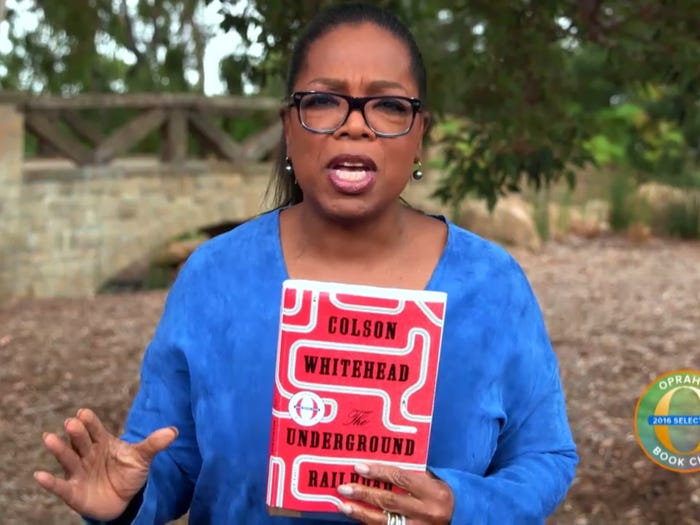
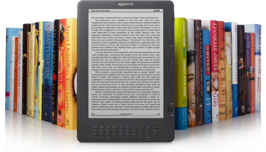

<h1 style="font-size:50px;">Analysis of Book Review Data</h1>

<i>Sergey Kamilchu</i>  
Data source: [S3 amazon AWS review data set](https://s3.amazonaws.com/amazon-reviews-pds/tsv/index.txt)

<h2 style="text-align:left; font-size:20px;">Project Index</h2>

*use these hyper links to jump to different sections*

<ol>
  <li style="text-align:left; font-size:15px;"><a href='#section1'>My intro on why books</a></li>
  <li style="text-align:left; font-size:15px;"><a href='#section2'>About the data</a></li>
  <li style="text-align:left; font-size:15px;"><a href='#section3'>Are paper books even relevant anymore?</a></li>
  <li style="text-align:left; font-size:15px;"><a href='#section4'>Analysis of paper vs digital title reviews</a></li>
  <li style="text-align:left; font-size:15px;"><a href='#section5'>Recommendation (END)</a></li>
</ol>

*“People are strange: They are constantly angered by trivial things, but on a major matter like totally wasting their lives, they hardly seem to notice.” **~ Charles Bukowski***
 

There was a point in my life where I noticed that change was necessary. Although I was unaware of the reasons that contributed to my having these incessant and nagging thoughts of urgency, I knew something had to be done. It turns out that there are plenty of bad-asses(alive and dead) that have been quite forthcoming when approached about their habits and the sources of power with which they forge themselves. With the mighty Internet at my finger tips I went looking for answers.
   

So it turns out, the thing that kept coming up was...

<h3 style="font-size:40px;">The greats read books</h3>

Bill Gates

William Henry Gates III is an American business magnate, software developer, investor, and philanthropist. He is best known as the co-founder of Microsoft Corporation. During his career at Microsoft, Gates held the positions of chairman, chief executive officer, president and chief software architect, while also being the largest individual shareholder until May 2014

*"Whether I'm at the office, at home, or on the road, I always have a stack of books I'm looking forward to reading." **~ Bill Gates***

<ul>
  <li style="text-align:left; font-size:15px;">reads about<a href="https://www.businessinsider.com/rich-people-like-to-read-2015-8"> 50 books per year</a></li>
  <li style="text-align:left; font-size:15px;">Bill wants you to read<a href='https://www.businessinsider.com/books-elon-musk-thinks-everyone-should-read-2018-4'>these 5 books from 2019 </a></li>
</ul>

Elon Musk

Elon Reeve Musk is an engineer and technology entrepreneur. He holds South African, Canadian, and U.S. citizenship and is the founder, CEO, and chief engineer/designer of SpaceX; CEO and product architect of Tesla, Inc.; founder of The Boring Company; co-founder of Neuralink; and co-founder and initial co-chairman of OpenAI

*"The heroes of the books I read ... always felt a duty to save the world,"  **~ Elon Musk***

<ul>
  <li style="text-align:left; font-size:15px;"><a href='https://www.businessinsider.com/elon-musk-favorite-books-2014-10?op=1'> List </a>of his favorite books</li>
  <li style="text-align:left; font-size:15px;"><a href='https://www.businessinsider.com/books-elon-musk-thinks-everyone-should-read-2018-4'>List </a>of 12 books that shaped Elon</li>
</ul>

Oprah Winfrey

Oprah Gail Winfrey is an American media executive, actress, talk show host, television producer, and philanthropist. She is best known for her talk show, The Oprah Winfrey Show, broadcast from Chicago, which was the highest-rated television program of its kind in history and ran in national syndication for 25 years from 1986 to 2011

*"Reading gave me the power to see possibilities beyond what was allowed at the time." **~ Oprah Gail Winfrey***  

Larry Page

Lawrence Edward Page is an American computer scientist and Internet entrepreneur. He is best known for being one of the co-founders of Google along with Sergey Brin. Page was the chief executive officer of Alphabet Inc. until stepping down on December 3, 2019

*‘It’s not necessary to go to school to launch a business. I read a whole shelf of business books and that was basically all I needed’. **~ Larry Page***  

- [Books list](http://www.favobooks.com/enterpreneurs/110-Larry-Page-books-that-stimulate-your-mind.html) he was influenced by

Looks ok so far.. what about some science?

A very small list of studies showing the measurable positive changes that reading has on the most important asset we posses in our lifetime: the brain.

<ul>
  <li style="font-size:15px;"><a href="https://n.neurology.org/content/81/4/314">It slows mental decline with age</a></li>
  <li style="text-align:left; font-size:15px;"><a href="https://n.neurology.org/content/81/4/314">It slows mental decline with age</a></li>
  <li style="text-align:left; font-size:15px;"><a href="https://science.sciencemag.org/content/342/6156/377.abstract">Can make you more empathetic</a></li>
</ul>

It used to be you couldn't catch me dead with a book! But after appreciation and careful consideration of the potential of the positive impact that books can have on one's self, I had no choice but to give it an honest go of acquiring the taste.  
So ends the intro and hopefully I've nudged you into wanting to either acquaint or re-acquaint yourself with some reading habits.

<h3 style="font-size:50px;">Analyze some reviews!</h3>

Welcome to the analysis section. Here you will look into the <a href="https://authorsmstevens.com/2019/06/26/the-ebook-vs-printed-book-debate/">book vs ebook</a> debate. I want to investigate what the data contained within the reviews can tell us.

<h2 style="font-size:40px;">About the data</h2>

<ul>
  <li style="font-size:15px;">review_id</li>
  <li style="font-size:15px;">customer_id</li>
  <li style="font-size:15px;">product_id</li>
  <li style="font-size:15px;">product_title</li>
  <li style="font-size:15px;"><a href="https://www.businessinsider.com/how-amazon-review-stars-are-calculated-2019-6">star_rating</a></li>
  <li style="font-size:15px;"><a href="https://www.businessinsider.com/how-amazon-review-stars-are-calculated-2019-6">verified_purchase</a></li>
  <li style="font-size:15px;"><a href="https://www.amazon.com/gp/customer-reviews/top-reviewer-faq.html">helpful_votes</a>
  <li style="font-size:15px;">total_votes</li>
  <li style="font-size:15px;"><a href="https://www.amazon.com/gp/vine/help">vine</a></li>
  <li style="font-size:15px;">review_date</li>
  <li style="font-size:15px;">season</li>

</ul>    

<h2 style="text-align:center-right; font-size:40px;">Is paper in danger?</h2>

Verified purchase reviews

<iframe src="./imgs_charts/1_verified_purchase_reviews_by_years.html"
    sandbox="allow-same-origin allow-scripts"
    width="100%"
    height="400"
    scrolling="no"
    seamless="seamless"
    frameborder="1">
</iframe>

*For above charts, a random fractional sample of each format was taken(0.01) because of the size of the data set* 
**Observations:**

- `Digital` has larger sample size and went into full swing on amazon market starting 2014. Despite this, `Paper` reviews seem to be going steady and not declining in frequency.