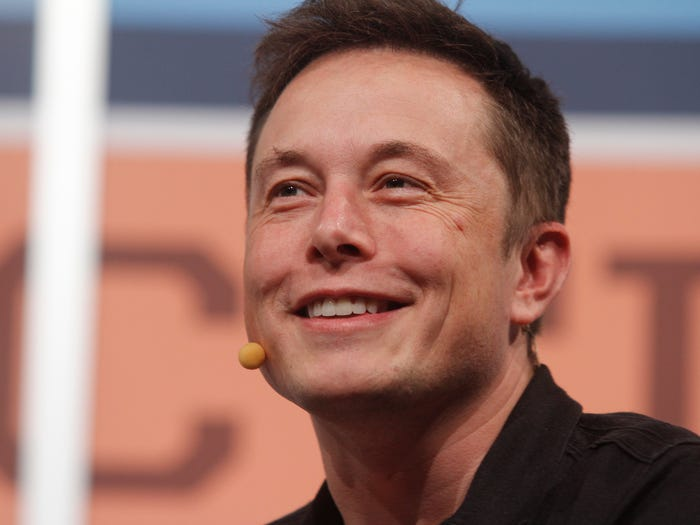
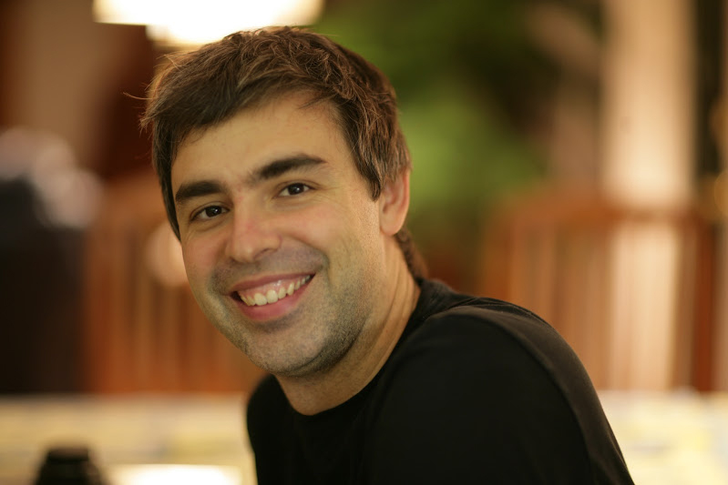

<h1 style="text-align:center; font-size:40px;">Analysis of Book Review Data</h1>

<i>Sergey Kamilchu</i>  
Data source: [S3 amazon AWS review data set](https://s3.amazonaws.com/amazon-reviews-pds/tsv/index.txt)

<h2 style="text-align:left; font-size:20px;">Project Index</h2>

*use these hyper links to jump to different sections*

<ol>
  <li style="text-align:left; font-size:15px;"><a href='#section1'>My intro on why books</a></li>
  <li style="text-align:left; font-size:15px;"><a href='#section2'>Data questions</a></li>
  <li style="text-align:left; font-size:15px;"><a href='#section3'>Are paper books even relevant anymore?</a></li>
  <li style="text-align:left; font-size:15px;"><a href='#section4'>Analysis of paper vs digital title reviews</a></li>
  <li style="text-align:left; font-size:15px;"><a href='#section5'>Recommendation (END)</a></li>
</ol>

*“People are strange: They are constantly angered by trivial things, but on a major matter like totally wasting their lives, they hardly seem to notice.” **~ Charles Bukowski***
 

There was a point in my life where I noticed that change was necessary. Although I was unaware of the reasons that contributed to my having these incessant and nagging thoughts of urgency, I knew something had to be done. It turns out that there are plenty of bad-asses(alive and dead) that have been quite forthcoming when approached about their habits and the sources of power with which they forge themselves. With the mighty Internet at my finger tips I went looking for answers.
   

So it turns out, the thing that kept coming up was...

<h3 style="text-align:left; font-size:40px;">The greats read books</h3>

Bill Gates

William Henry Gates III is an American business magnate, software developer, investor, and philanthropist. He is best known as the co-founder of Microsoft Corporation. During his career at Microsoft, Gates held the positions of chairman, chief executive officer, president and chief software architect, while also being the largest individual shareholder until May 2014

*"Whether I'm at the office, at home, or on the road, I always have a stack of books I'm looking forward to reading." **~ Bill Gates***

- reads about [50 books per year](https://www.businessinsider.com/rich-people-like-to-read-2015-8), which breaks down to 1 per week  
- Bill wants you to read [these 5 books from 2019](https://time.com/5746591/bill-gates-best-books-2019/)

Elon Musk

Elon Reeve Musk is an engineer and technology entrepreneur. He holds South African, Canadian, and U.S. citizenship and is the founder, CEO, and chief engineer/designer of SpaceX; CEO and product architect of Tesla, Inc.; founder of The Boring Company; co-founder of Neuralink; and co-founder and initial co-chairman of OpenAI

*"The heroes of the books I read ... always felt a duty to save the world," **~ Elon Musk***

- [List](https://www.businessinsider.com/elon-musk-favorite-books-2014-10?op=1) of his favorite books   
- [List](https://www.businessinsider.com/books-elon-musk-thinks-everyone-should-read-2018-4) of 12 books that shaped Elon

Oprah Winfrey

Oprah Gail Winfrey is an American media executive, actress, talk show host, television producer, and philanthropist. She is best known for her talk show, The Oprah Winfrey Show, broadcast from Chicago, which was the highest-rated television program of its kind in history and ran in national syndication for 25 years from 1986 to 2011

*"Reading gave me the power to see possibilities beyond what was allowed at the time." **~ Oprah Gail Winfrey***  

Larry Page

Lawrence Edward Page is an American computer scientist and Internet entrepreneur. He is best known for being one of the co-founders of Google along with Sergey Brin. Page was the chief executive officer of Alphabet Inc. until stepping down on December 3, 2019

*‘It’s not necessary to go to school to launch a business. I read a whole shelf of business books and that was basically all I needed’. **~ Larry Page***

- [Books list](http://www.favobooks.com/enterpreneurs/110-Larry-Page-books-that-stimulate-your-mind.html) he was influenced by